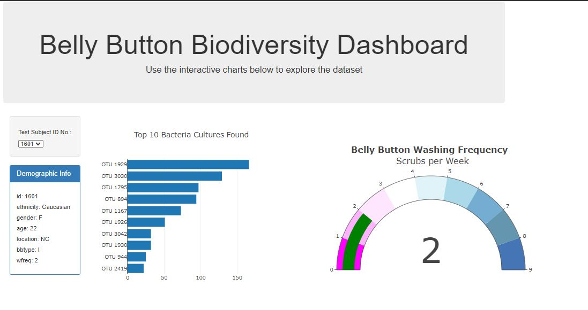
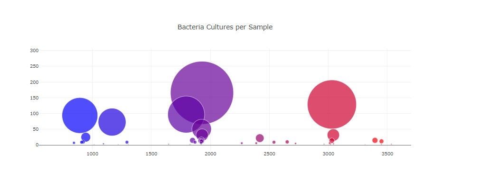

# plotly-challenge

For this challenge we were asked to complete our first Dashboard using plotly. Dashboards are very popular with C suite executives and there some great real world examples for this. At the hospital where I work the corporate office is quite proud of their dashboards. As I was working on this assignment I referred to some of the dashboards I see everyday to get an idea on the code used internally to create these dashboards.
This is an exmaple of what you will see when you look at the webpage.

You can get to the webpage by clicking on this link:
https://jenmusdat.github.io/plotly-challenge/

# Process:

To create this dashboard I did the following:

1. Read in the .json file
1. Created the dropdown menu
1. Created a function to filter out selctions from the dropdown menu
1. Created a bar graph
1. Created a bubble graph
1. Created a gauge graph
1. Made it so that the data would reset everytime you updated the code
1. I finished by working on styling

## Submitted by

## Jenny Kaylor

## 1.19.2021
